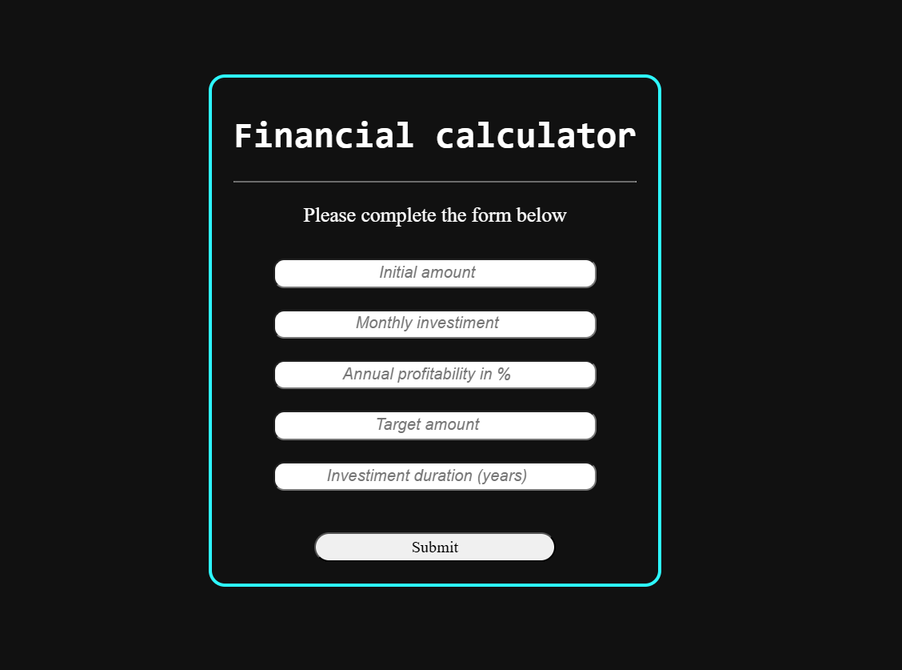
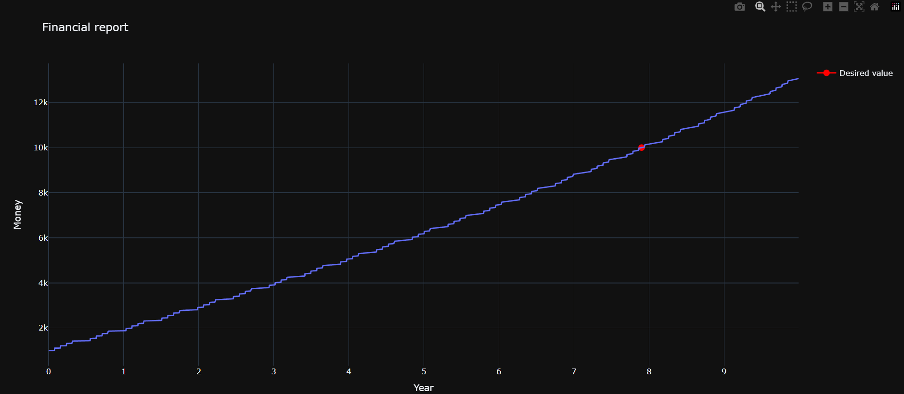

# Financial investiment
This repository provides the source code for a financial calculator Web API. The program is made to provide a basic and simplified long-term finance plan using fixed-income investments.
The application requests the following information from the user:
- <b>Initial amount</b>: how much money the user already have.
- <b>Monthly investment</b>: how much money the user intends to invest monthly.
- <b>Annual profitability in %</b>: the interest rate to be earned by the fixed-income investment during a period of one year.
- <b>Target amount</b>: the value you want to achieve with this investment. If, given the conditions, it is reached, then it will be highlighted on the result graph.
- <b>Investiment duration (years)</b>: how long the user intends to follow with this investiment plan.

With it, the API returns a graphic `Time x Money` representation of the financial planning considering a fixed income investment.

By default, the application follows the Brazil CDB (Bank Deposit Certificate) income tax (IR) discount, which is defined as follows:
- Up to 180 days: 22.5%;
- From 181 to 360 days: 20%;
- From 361 to 720 days: 17.5%;
- More than 721 days: 15%.

Note: IR is only applied to profit.

The IOF (Financial Transactions Tax) discount, which is only applied during the first month after the investiment start, is disregarded because time periods tend to be long.
It is assumed that there is no administration fee.
Daily liquidity income is considered to occur only on business days (weekends are not considered).

It is important to highlight that the program presents an approximate and not entirely realistic result, as the IOF and possible rate fluctuations that may occur over the years are disregarded. Futhermore, for more pratical results, inflation should be considered.

# How to use

Firstly, ensure you have the python version specified in `python-version.txt` installed in your machine.

Then, clone this repository:
```
git clone https://github.com/lcaioporto/Finance-investment.git
```
Install the required libraries:
```
pip install -r requirements.txt
```
And finally run the application:
```
python backend/api.py
```
With this, you will be able to access the Web API in the address [http://0.0.0.0:8000](http://0.0.0.0:8000) by opening it using your web browser.

# Application example

Form:


Interactive graphic highlighting the target amount:
